# 🐍 Flask Microservice · Containerized · CI/CD · CloudWatch Monitoring

## 📌 Project Overview

This project is a **containerized Flask microservice** that demonstrates a complete DevOps lifecycle:

- ✅ REST API with Flask + SQLAlchemy ORM + PostgreSQL
- ✅ Multi-stage Docker build with security hardening
- ✅ GitHub Actions CI/CD pipeline (test → build → scan → deploy)
- ✅ Health-gated zero-downtime deployments to EC2
- ✅ Custom CloudWatch metrics for application-level monitoring
- ✅ Git tagging for versioned releases

---

## 📋 Prerequisites

- Docker & Docker Compose (v24+)
- Python 3.11+ (for local testing)
- AWS account (for EC2 deployment)
- GitHub account (for CI/CD)

---

## 📡 API Endpoints

| Method | Endpoint | Description |
|--------|----------|------------|
| GET | `/health` | Health check (app + DB status) |
| GET | `/items` | List all items |
| POST | `/items` | Create new item |
| GET | `/items/<id>` | Fetch single item |
| DELETE | `/items/<id>` | Delete item |

### Example Requests

**Health Check:**
```bash
curl http://localhost:5000/health
```

**Create Item:**
```bash
curl -X POST http://localhost:5000/items \
  -H "Content-Type: application/json" \
  -d '{"name": "My Item", "description": "..."}'
```

**List Items:**
```bash
curl http://localhost:5000/items
```

---

## 🏗️ Architecture

```
GitHub Push
    │
    ▼
GitHub Actions (Test → Build → Scan → Deploy)
    │
    ├── Test: pytest + coverage (≥80%)
    ├── Build: multi-stage Docker image
    ├── Scan: Trivy vulnerability scan
    └── Deploy: SSH to EC2 → pull image → health check → rollback on failure
    │
    ▼
EC2 Instance
    ├── Flask Container (app)
    ├── PostgreSQL Container (database)
    └── Cron Job (push_health_metric.py → CloudWatch every minute)
    │
    ▼
CloudWatch
    ├── AppHealthStatus (1=up, 0=down)
    ├── DBHealthStatus (1=connected, 0=down)
    └── HealthCheckResponseTime (ms)
```

---

## 🛠️ Technologies Used

| Layer | Technology |
|-------|------------|
| **Application** | Flask, Flask-SQLAlchemy, psycopg2 |
| **Database** | PostgreSQL 16 (Alpine) |
| **Containerization** | Docker, Docker Compose |
| **CI/CD** | GitHub Actions (YAML) |
| **Orchestration** | Docker Compose (local + production) |
| **Monitoring** | CloudWatch Custom Metrics, boto3 |
| **Security** | Trivy, non-root user, read-only FS, dropped capabilities |
| **Scripting** | Bash, Python |
| **Cloud** | AWS EC2, IAM, CloudWatch |

---

## 📁 Project Structure

```
flask-microservice/
├── .github/
│   └── workflows/
│       └── cicd.yml                 # GitHub Actions pipeline
├── app/
│   ├── __init__.py                  # Flask Application Factory
│   ├── routes.py                    # Blueprint routes
│   ├── models.py                    # SQLAlchemy models
│   └── database.py                  # DB initialization
├── tests/
│   ├── test_routes.py               # API endpoint tests
│   └── test_models.py               # Model tests
├── scripts/
│   ├── deploy.sh                    # Deployment script (health-gated)
│   └── push_health_metric.py        # CloudWatch metric pusher (cron)
├── Dockerfile                       # Multi-stage build
├── docker-compose.yml               # Local development
├── docker-compose.prod.yml          # Production (hardened)
├── requirements.txt                 # Python dependencies
└── README.md
```

---

## 🚀 Pipeline Stages

| Stage | Trigger | What happens |
|-------|---------|--------------|
| **Test** | Every push/PR | `pytest` with coverage (must be ≥80%) |
| **Build & Push** | Every push | Build multi-stage image → push to Docker Hub |
| **Scan** | Every push | Trivy scans for CRITICAL/HIGH CVEs (report only) |
| **Deploy** | Push to `main` only | SSH to EC2 → copy files → run `deploy.sh` |

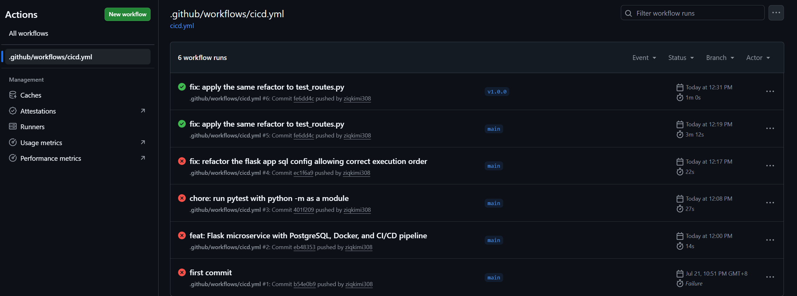

---

## 🔐 Security Hardening (Production)

| Feature | Why |
|---------|-----|
| **Multi-stage Dockerfile** | Final image excludes `gcc`, headers → ~100MB smaller |
| **Non-root user (`appuser`)** | Prevents privilege escalation |
| **`read_only: true`** | Root filesystem is immutable |
| **`tmpfs: /tmp`** | Only writable path is in-memory (ephemeral) |
| **`cap_drop: ALL`** | No Linux capabilities granted to container |
| **Trivy scan** | Identifies CVEs before deployment |
| **Secrets via GitHub Secrets + EC2 `.env`** | No secrets in code or pipeline logs |

---

## 📊 Monitoring

A cron job runs `push_health_metric.py` every minute, pushing three custom metrics to CloudWatch:

| Metric | Value | Use case |
|--------|-------|----------|
| `AppHealthStatus` | 1 = up, 0 = down | Alarm on app failure |
| `DBHealthStatus` | 1 = connected, 0 = down | Debug DB vs app crash |
| `HealthCheckResponseTime` | Milliseconds | Performance trending |

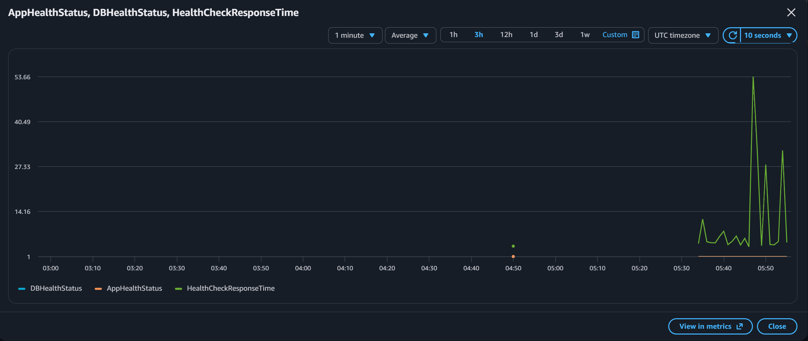

---

## 🏷️ Git Tagging & Versioned Releases

```bash
git tag -a v1.0.0 -m "Release v1.0.0 — initial microservice"
git push origin v1.0.0
```

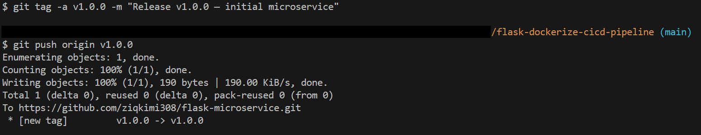

---

## 🚀 Deploying to EC2

### Prerequisites
- ✅ EC2 instance running (Ubuntu 22.04 LTS+)
- ✅ Security group allows SSH (port 22) and HTTP (port 80)
- ✅ EC2 IAM role attached with CloudWatch permissions
- ✅ GitHub Secrets configured: `EC2_HOST`, `EC2_USER`, `EC2_KEY`, `DOCKER_HUB_USERNAME`, `DOCKER_HUB_TOKEN`

### Steps

| Step | Screenshot |
|------|------------|
| **1. SSH into EC2 & update packages** | 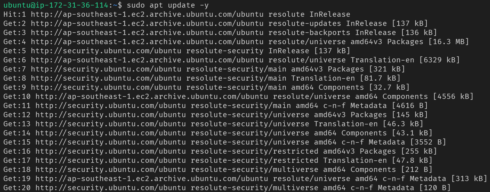 |
| **2. Install curl, ca-certificates, gnupg** | 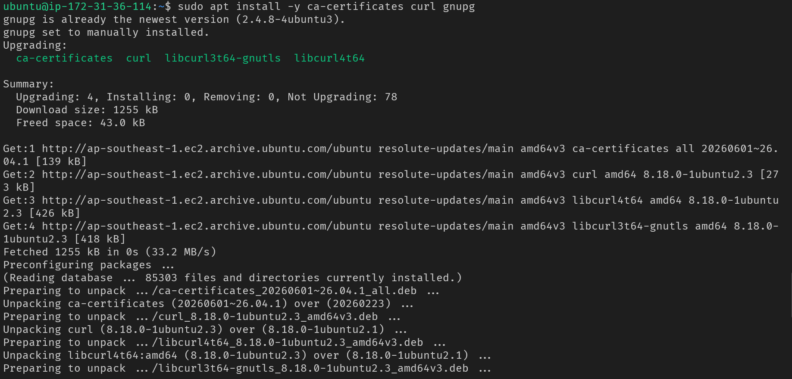 |
| **3. Add Docker official signature** | 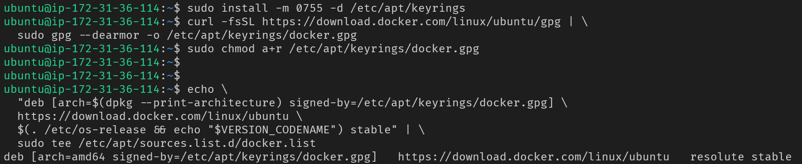 |
| **4. Verify Docker installation** | 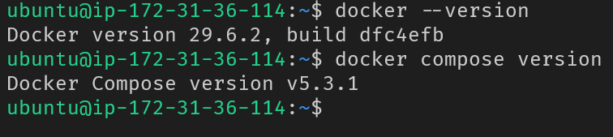 |
| **5. Add EC2 instance** | 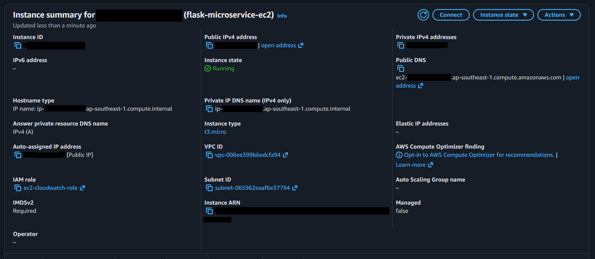 |
| **6. Attach IAM role for CloudWatch** | 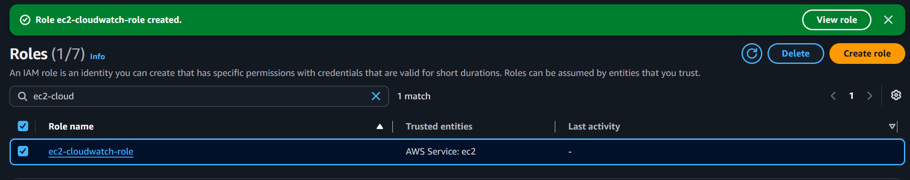 |

### Deployment Flow
1. Push to `main` → GitHub Actions pipeline triggers
2. Pipeline runs: test → build → scan → deploy
3. Deploy stage SSH's to EC2 and runs `deploy.sh`
4. `deploy.sh` pulls latest image, stops old container, starts new one
5. Health endpoint checked — automatic rollback on failure

| | Screenshot |
|-|------------|
| **Containers running on EC2** | 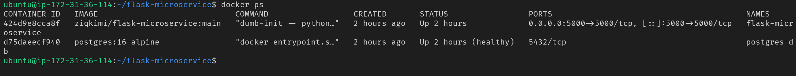 |
| **Images on Docker Hub** | 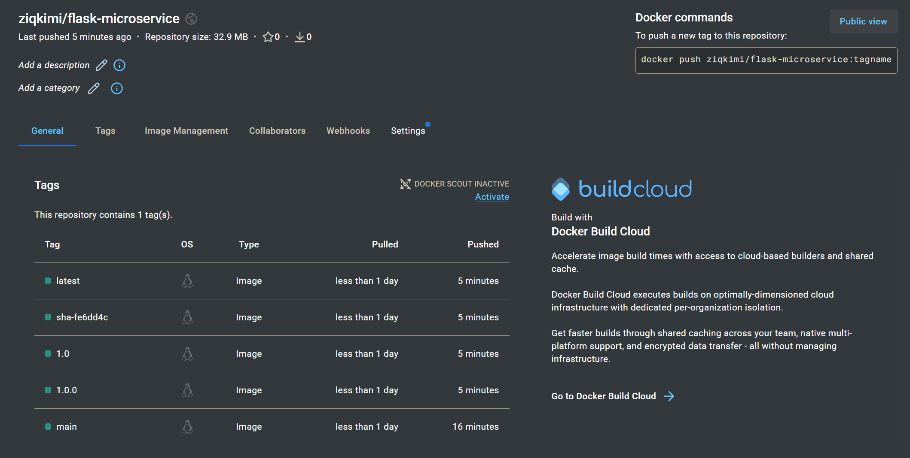 |

### API Testing on EC2

| Endpoint | Screenshot |
|----------|------------|
| **GET /health** | 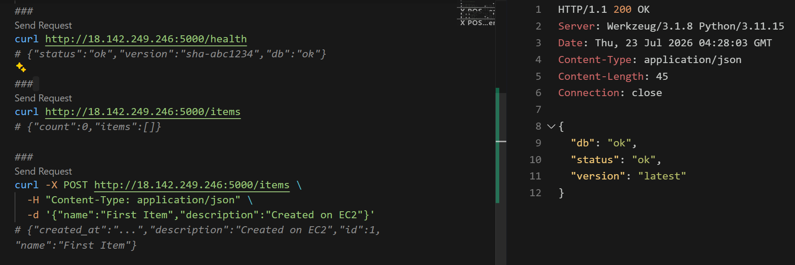 |
| **GET /items** | 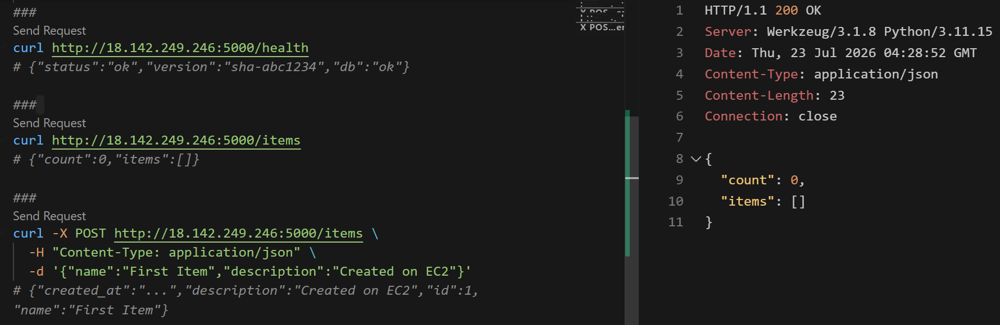 |
| **POST /items** | 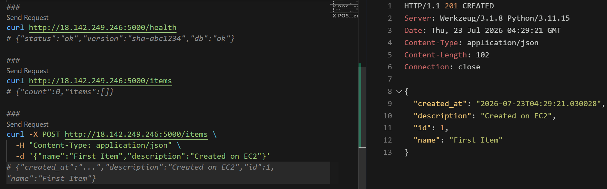 |
| **Browser** | 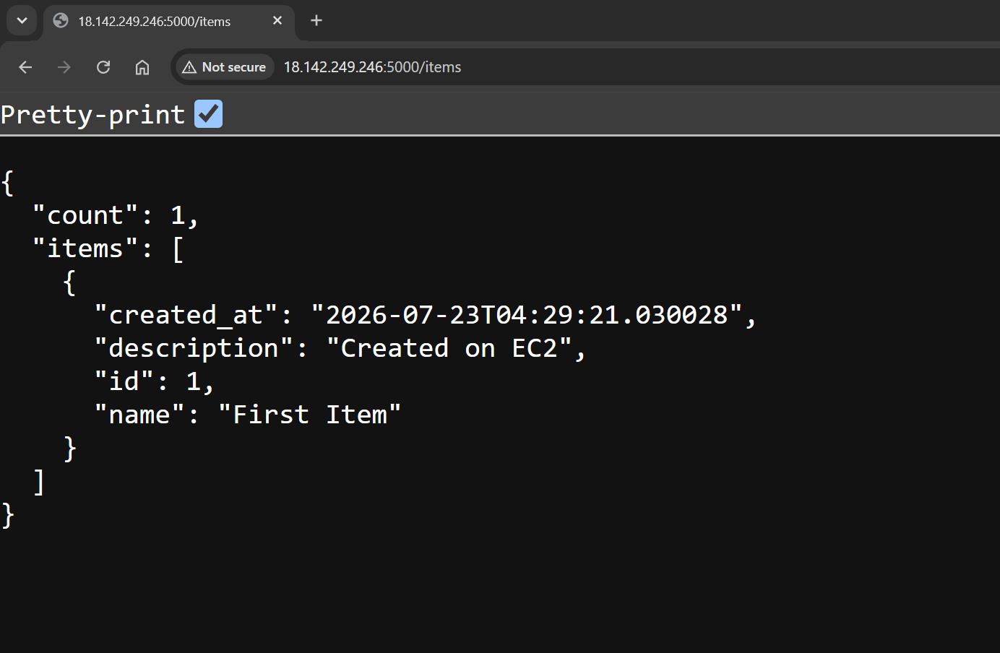 |

---

## 🧹 Cleanup

```bash
# On EC2
docker compose -f docker-compose.prod.yml down
docker volume rm flask-microservice_postgres-data
crontab -r

# In AWS Console
EC2 → Terminate instance
CloudWatch → Delete alarm (optional)
```

---

## 🧠 Lessons Learned (Issues & Key Takeaways)

Throughout the development lifecycle, I encountered and resolved a series of real-world engineering challenges. Each issue contributed to a deeper understanding of the underlying technologies and reinforced core DevOps principles.

---

### 1. Flask Application Factory & Blueprint Pattern

**Issue:** Understanding the separation between `app/__init__.py` and `routes.py` required navigating Flask's Application Factory pattern. The decoupling of route definitions from the main application instance initially appeared non-intuitive.

**Root Cause:** The `app/__init__.py` file is the entry point for the Flask application. Without an import from `routes.py`, the route decorators are never executed, rendering all endpoints unreachable. This mirrors the Express.js pattern where `app.use()` attaches route handlers to the application.

**Resolution:** Routes are defined on a `Blueprint` instance rather than the `app` object directly. The blueprint is then imported and registered with the Flask application:

```python
# routes.py
bp = Blueprint("main", __name__)

@bp.route("/health")
def health():
    return {"status": "ok"}

# __init__.py
from app.routes import bp
app.register_blueprint(bp)
```

**Key Takeaway:** Blueprints serve as modular route containers, analogous to Express Routers. They enable scalable application architecture by decoupling route definitions from the core application instance, thereby avoiding circular import dependencies.

---

### 2. Docker Compose Service Discovery

**Issue:** The Flask application initially attempted to connect to PostgreSQL using `localhost`, resulting in connection refused errors during container startup.

**Root Cause:** `localhost` within a Docker container resolves to the container itself, not the host machine. Since PostgreSQL runs in a separate container, the Flask container cannot locate it via `localhost`.

**Resolution:** Docker Compose provides automatic DNS resolution between services. The Flask application must reference the database using the service name defined in the compose file:

```yaml
# docker-compose.yml
services:
  flask:
    environment:
      - DB_HOST=postgres   # Resolves to the postgres container's internal IP
  postgres:
    image: postgres:16-alpine
```

**Key Takeaway:** In Docker Compose, service names function as internal hostnames. The Docker daemon performs automatic DNS resolution, enabling inter-container communication without manual IP assignment.

---

### 3. SQLAlchemy `db` vs Flask `app` (Naming Ambiguity)

**Issue:** The overlapping use of `app` to refer to both the Flask application instance and the `app/` directory introduced confusion during development and debugging.

**Resolution:** Clarity emerged through explicit understanding of the distinct components:

| Identifier | Type | Purpose |
|------------|------|---------|
| `app/` | Directory | Contains application source code |
| `app` | Flask instance | Web server object handling HTTP requests |
| `db` | SQLAlchemy instance | ORM manager providing database abstraction |

`init_db(app)` explicitly binds the SQLAlchemy `db` object to the Flask `app` instance, establishing the connection between the database manager and the web application.

**Key Takeaway:** Differentiating between the filesystem structure, the web server instance, and the ORM manager is essential for understanding Flask's architecture. `init_db(app)` serves as the bridge connecting the database abstraction layer to the Flask application.

---

### 4. SSH Private Key Permissions on Windows

**Issue:** SSH rejected the EC2 private key with `Bad permissions... key file is too open`.

**Root Cause:** SSH enforces strict security checks on private key files. Windows' default permission scheme grants read access to the `Authenticated Users` group, which violates the stringent security requirements SSH mandates for private key files. Consequently, SSH identifies this as a security risk and rejects the key to prevent potential unauthorized access.

**Resolution:** The `icacls` command was used to reset the permissions, stripping all inherited and group-based access rights:

```powershell
icacls .\flask-microservice-ec2-key.pem /grant:r "$($env:username):(R)"
```

**Key Takeaway:** SSH requires private key files to be readable exclusively by the owning user (permission 600 on Linux systems). Windows' `icacls` utility enables equivalent permission hardening, ensuring the key adheres to SSH's security requirements.

---

### 5. `python -m pytest` vs `pytest` (Module Discovery)

**Issue:** Pipeline tests failed with `ModuleNotFoundError: No module named 'app'`, despite the module being present in the repository.

**Root Cause:** When invoked directly as `pytest`, the command does not guarantee that the current working directory is added to Python's `sys.path`. Consequently, the `app` package is not discoverable during test collection.

**Resolution:** Execute pytest as a Python module to ensure the working directory is included in `sys.path`:

```yaml
- name: Run tests with coverage
  run: |
    python -m pytest tests/ -v --cov=app --cov-fail-under=80
```

**Key Takeaway:** Running pytest as a Python module (`python -m pytest`) ensures proper module resolution and consistent behavior across local and CI environments.

---

### 6. Test Database Isolation (SQLite In-Memory)

**Issue:** Test fixtures attempted to connect to the production PostgreSQL database at `localhost:5432`, resulting in `Connection refused` errors.

**Root Cause:** The `create_app()` function invoked `init_db(app)` before the test fixture could override the `SQLALCHEMY_DATABASE_URI`. The database initialization executed with the default URI, which points to `localhost:5432`.

**Resolution:** Refactor `create_app()` to accept a `test_config` parameter, applying configuration overrides before database initialization:

```python
def create_app(test_config=None):
    app = Flask(__name__)
    app.config["SQLALCHEMY_DATABASE_URI"] = "postgresql://..."
    
    if test_config:
        app.config.update(test_config)   # Override BEFORE init_db()
    
    init_db(app)
    return app
```

**Test fixture implementation:**

```python
@pytest.fixture(scope="module")
def app():
    test_app = create_app(test_config={
        "SQLALCHEMY_DATABASE_URI": "sqlite:///:memory:",
        "TESTING": True
    })
    return test_app
```

**Key Takeaway:** Configuration overrides must be applied *before* the database is initialized. The Application Factory pattern with `test_config` support enables deterministic, isolated test execution without external dependencies.

---

### 7. Cron Job Logging Permissions

**Issue:** The cron job executed successfully (confirmed via `sudo grep CRON /var/log/syslog`), but the log file `/var/log/health-metric.log` was never created.

**Root Cause:** The `ubuntu` user lacks write permissions to `/var/log/`. File creation in this directory requires root privileges. The redirect operation failed silently, resulting in no log output.

**Resolution:** Redirect output to a user-owned directory:

```bash
(crontab -l 2>/dev/null; echo "* * * * * INSTANCE_ID=local python3 /home/ubuntu/flask-microservice/push_health_metric.py >> /home/ubuntu/health-metric.log 2>&1") | crontab -
```

**Key Takeaway:** Cron job output should always be redirected to a location where the executing user has write permissions. Directories such as `/home/ubuntu/` or `/tmp/` are suitable alternatives to `/var/log/`.

---

### 8. EC2 Metadata Service (Instance ID Retrieval)

**Issue:** `curl http://169.254.169.254/latest/meta-data/instance-id` returned no output.

**Resolution:** The `push_health_metric.py` script defaults to `local` when the `INSTANCE_ID` environment variable is not set. CloudWatch receives the metrics with the dimension `InstanceId: local`, which is sufficient for demonstration and monitoring purposes.

**Implementation:** The cron job was configured with `INSTANCE_ID=local`, eliminating the dependency on metadata service accessibility.

**Key Takeaway:** Defensive programming with sensible fallback values ensures system reliability. Hardcoding the `INSTANCE_ID` to `local` provides a resilient monitoring solution that operates regardless of metadata service availability.

---

### 9. Error Log Reading (5-Step Method)

**Issue:** Massive, deeply nested error logs were difficult to parse and interpret during pipeline failures.

**Resolution:** A systematic error reading methodology was adopted:

1. **Scroll to the bottom** → Identify the final exception and its type.
2. **Locate the specific exception text** → Extract the direct error message.
3. **Identify the root cause above "The above exception..."** → The actual problem is listed above this phrase.
4. **Search for project code paths** → Locate `app/` or `tests/` entries in the stack trace.
5. **Ignore framework internals** → Framework code is reactive; project code is the trigger.

**Key Takeaway:** Large error logs are effectively navigated by focusing on the exception type, the specific error message, and project-specific code paths. Framework internals typically do not provide actionable information and can be safely ignored.

---

### 10. Conventional Commits (`feat` vs `chore`)

**Issue:** Uncertainty regarding appropriate commit message prefixes for different types of changes.

**Resolution:** The Conventional Commits specification provides clear categorization:

| Prefix | Application |
|--------|-------------|
| `feat:` | New user-facing features or functionality |
| `fix:` | Bug fixes |
| `chore:` | Maintenance tasks (dependency updates, CI configuration, documentation) |
| `docs:` | Documentation changes |

**Key Takeaway:** Conventional Commits enable automated semantic versioning and clean changelog generation. They also facilitate rapid comprehension of commit history by categorizing changes at a glance.

## 📚 Key Takeaways

| Concept | What I Learned |
|---------|----------------|
| **Flask Blueprints** | They are containers for routes—like Express Router in Node.js. |
| **Application Factory Pattern** | `create_app()` allows per-test config overrides. |
| **Docker Multi-stage** | Builder stage has compiler; final stage only runtime libs. |
| **Health-Gated Deploy** | Always check `/health` after deploy—rollback if it fails. |
| **Custom CloudWatch Metrics** | Push app-level metrics (status, DB, response time) via `boto3`. |
| **EC2 IAM Role** | EC2 assumes role → no hardcoded AWS credentials. |
| **SSH Key Permissions** | Private keys must be readable only by the owner (600). |
| **Cron + Logs** | Always redirect to a user-owned directory to avoid permission issues. |
| **Read Error Logs** | Scroll to the bottom → find the exception → find YOUR code in the trace. |
| **Conventional Commits** | `feat` = new feature; `chore` = maintenance. |

